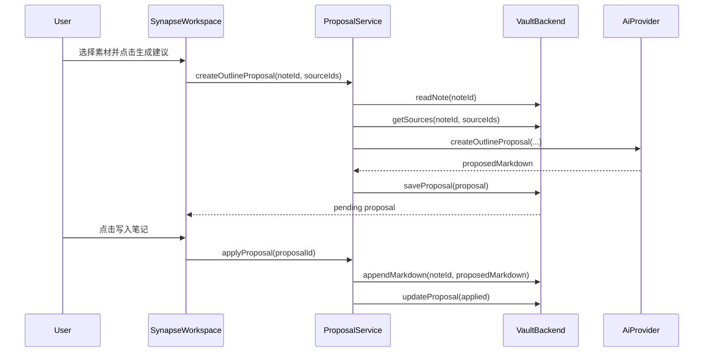

# Synapse 架构文档

## 1. 架构目标

Synapse 的架构目标是用 Flutter + Dart 构建一个多端学习资料整理工具，同时确保桌面端数据以 Markdown Vault 为真源。AI、搜索、SQLite、素材处理和 Web 预览都必须围绕这个原则设计：缓存可以删除，用户内容不能被锁进私有数据库。

## 2. 技术栈

| 层面 | 技术 | 当前状态 |
| --- | --- | --- |
| Runtime | Flutter / Dart | 已使用 |
| UI | Material 3、Flutter widgets | 已使用 |
| 状态管理 | Riverpod | 依赖已引入，当前 UI 仍以 `StatefulWidget` 为主 |
| Markdown 预览 | `flutter_markdown` | 已使用 |
| 桌面文件 | macOS 原生目录选择、security-scoped bookmark、`dart:io` | 已使用 |
| 路径处理 | `path`、`path_provider` | 已引入 |
| 缓存数据库 | `sqlite3`、`sqlite3_flutter_libs` | 搜索缓存已实现 |
| AI 请求 | `http` | 依赖已引入，真实 Provider 待实现 |
| 测试 | `flutter_test`、Flutter widget tests | 已使用 |

## 3. 分层架构

目标分层如下：

```text
presentation
  Flutter 页面、控件、用户交互、异步状态展示

application
  用例编排：导入素材、生成 proposal、应用 proposal、重建索引

domain
  纯 Dart 模型、Markdown/frontmatter 解析、大纲派生、基础规则

infrastructure
  Vault 文件系统、Web 内存库、AI Provider、搜索缓存、平台适配
```

当前代码已经按目录拆出 `domain`、`application`、`infrastructure` 和 `presentation` 的边界。[lib/main.dart](/Users/bruce/Workspace/1coos/synapse/lib/main.dart) 只负责应用装配，主工作台集中在 [lib/presentation/cupertino/workspace.dart](/Users/bruce/Workspace/1coos/synapse/lib/presentation/cupertino/workspace.dart)。后续建议继续把 `SynapseWorkspace` 拆为页面、controller 和 Riverpod providers。

## 4. 目录结构

```text
lib/
  main.dart
  application/
    proposals/
      proposal_service.dart
  domain/
    markdown/
      markdown_document.dart
    vault/
      vault_resource.dart
  infrastructure/
    ai/
      ai_provider.dart
      mock_ai_provider.dart
    cache/
      memory_search_cache.dart
      sqlite_search_cache.dart
    vault/
      vault_backend.dart
      file_vault_backend.dart
      memory_vault_backend.dart
      default_vault_backend.dart
      default_vault_backend_io.dart
      default_vault_backend_web.dart
  presentation/
    cupertino/
      workspace.dart
test/
  application/
  domain/
  infrastructure/
  presentation/
```

### 4.1 `domain`

`domain` 不依赖 Flutter UI 和平台文件系统。它定义核心模型和 Markdown 规则：

- `VaultResourceNode`：资源树节点，表示文件夹或普通 Markdown 笔记。
- `VaultNote` / `VaultNoteContent`：笔记摘要、Markdown、大纲和素材。
- `SourceItem`：导入素材。
- `OutlineNode`：由 Markdown 标题派生的大纲节点。
- `AiProposal`：AI 建议。
- `ProviderConfig`：AI Provider 配置模型。
- `MarkdownDocument`：frontmatter 与正文解析。

### 4.2 `application`

`application` 负责用例编排，不直接关心 UI。当前有 `ProposalService`：

- 读取当前笔记和素材。
- 调用 `AiProvider.createOutlineProposal`。
- 保存 `AiProposal`。
- 用户确认后把 proposal 追加写入 Markdown。
- 更新 proposal 状态。

后续应继续放入这些用例：

- `ImportSourceService`：剪贴板、截图、文件导入。
- `ImageProcessingService`：OCR/视觉理解任务。
- `SearchIndexService`：索引增量更新与重建。
- `VaultRebuildService`：从 Markdown 和附件重建缓存。

### 4.3 `infrastructure`

`infrastructure` 负责与外部系统交互：

- `FileVaultBackend`：桌面端真实文件读写。
- `MemoryVaultBackend`：Web/H5 预览和测试用内存库。
- `AiProvider`：AI 能力抽象。
- `MockAiProvider`：无 key 环境的可运行 Provider。
- `MemorySearchCache`：UI 当前使用的内存搜索。
- `SqliteSearchCache`：桌面端可持久化、可重建搜索缓存。

### 4.4 `presentation`

当前 presentation 主要在 `lib/presentation/cupertino/workspace.dart`：

- 顶栏：Vault 选择、搜索、状态消息。
- 左栏：根级新建、Apple Notes 式资源树、文件夹右键菜单、笔记右键菜单、大纲树。
- 中栏：Markdown 阅读和源码编辑。
- 右栏：素材录入、图片导入、proposal 列表和确认写入。

后续建议拆分：

```text
lib/presentation/workspace/
  synapse_workspace.dart
  workspace_controller.dart
  resource_pane.dart
  editor_pane.dart
  source_pane.dart
  outline_tree.dart
  proposal_panel.dart
```

## 5. 核心数据模型

### 5.1 `VaultResourceType`

| 值 | 说明 |
| --- | --- |
| `folder` | Vault 文件夹 |
| `note` | 普通 Markdown 笔记 |

### 5.2 `SourceType`

| 值 | 当前含义 |
| --- | --- |
| `text` | 用户粘贴的文本素材 |
| `image` | 用户导入的图片素材 |

### 5.3 `SourceState`

| 值 | 含义 |
| --- | --- |
| `ready` | 素材可用于 proposal |
| `pending` | 素材等待处理，例如图片等待 OCR |
| `processed` | 素材已完成处理 |
| `failed` | 素材处理失败 |

当前文本素材写入后是 `ready`，图片素材写入后是 `pending`。

### 5.4 `ProposalStatus`

| 值 | 含义 |
| --- | --- |
| `pending` | 等待用户审核 |
| `applied` | 已写入 Markdown |
| `rejected` | 用户拒绝 |

当前 UI 支持 `pending` 到 `applied`，`rejected` 模型已存在但 UI 尚未接入。

## 6. Vault 数据契约

### 6.1 目标目录结构

```text
<vault-root>/
  读书/
    心经.md
    心经.assets/
      attachments/
        image-name-uuid.png
      sources.json
      proposals.json
  笔记.md
  笔记.assets/
    attachments/
      image-name-uuid.png
  .synapse-cache/
    search.sqlite
```

### 6.2 真源与缓存

| 路径 | 类型 | 是否真源 | 说明 |
| --- | --- | --- | --- |
| `<folder>/<note>.md` | Markdown | 是 | 用户主笔记 |
| `<note>.assets/attachments/` | 文件 | 是 | 图片等附件 |
| `<note>.assets/sources.json` | JSON | 过渡元数据 | 当前用于快速列出素材，后续应可从附件和 Markdown 重建 |
| `<note>.assets/proposals.json` | JSON | 否 | 当前笔记的 proposal 缓存和状态 |
| `<vault>/.synapse-cache/search.sqlite` | SQLite | 否 | 搜索与 embedding 缓存 |

### 6.3 笔记 frontmatter

当前普通 Markdown 笔记使用以下 frontmatter：

```yaml
---
title: 笔记标题
createdAt: 2026-07-01 08:00
updatedAt: 2026-07-01 08:00
---
```

笔记 id 使用相对 Vault 的 Markdown 路径，例如 `读书/心经.md`。内部 id 不写入用户可见 Markdown。

正文使用 Markdown 标题表达大纲：

```markdown
# 笔记标题

## 学习框架

## 知识点

| 类型 | 内容 | 备注 |
| --- | --- | --- |
```

### 6.4 大纲派生规则

`MarkdownDocument.extractOutline` 扫描正文中的 `#` 到 `######` 标题：

- 标题层级决定树形父子关系。
- 行号用于定位。
- 标题文本会去掉结尾多余 `#`。
- 节点 ID 由行号和标题 slug 组成。

大纲是派生数据，不单独落盘。这样可以避免 Markdown 和树形数据库之间出现同步冲突。

### 6.5 附件路径规则

图片导入时写入当前笔记的同名 `.assets/attachments/` 目录。保存到 `SourceItem.attachmentPath` 的路径使用 `/`，并保持相对 assets 根目录：

```text
attachments/filename.png
```

Markdown 中引用附件时也应使用相对路径，确保 Obsidian 可以直接解析。编辑区直接粘贴剪贴板图片时，系统复用同一条附件保存链路，并在当前光标位置插入 HTML 图片标签：

```html

```

`src` 相对当前 Markdown 文件，剪贴板图片优先使用毫秒时间戳文件名，例如 `1783082971508.png`、`1783082971508-2.png`；`width` 只表示显示宽度，不改变原始附件。预览区通过拖拽图片右下角把手调整显示宽度，拖拽结束后回写同一个 `width` 属性并保存 Markdown。把图片拖到另一张图片左侧或右侧时，Synapse 会把对应 `` 移动到同一段，用单个空格连接；同一段多个 `` 表示并排图片流，预览宽度不足时自动换行。Synapse 自己生成的编辑区图片标签不写 `alt` 属性。

## 7. 平台适配

### 7.1 条件导出

`default_vault_backend.dart` 使用 Dart 条件导出：

```dart
export 'default_vault_backend_web.dart'
    if (dart.library.io) 'default_vault_backend_io.dart';
```

桌面端和 Web 端通过同一个 `createDefaultVaultBackend` 入口创建不同实现，UI 不直接依赖 `dart:io`。

### 7.2 桌面端

桌面端使用 `FileVaultBackend`：

- 首次启动没有已保存位置时，必须通过系统目录选择器选择 Vault 目录。
- macOS 选择目录时会保存 security-scoped bookmark；下次启动先恢复目录访问并验证目录存在，再创建 `FileVaultBackend`。
- 已保存位置失效时提示用户重选，不自动创建目录、不回退到当前工作目录。
- 创建文件夹时写入真实目录。
- 创建笔记时写入普通 `.md` 文件。
- 图片会复制到同名 `.assets/attachments/`。
- 重命名或移动笔记时移动 `.md` 和同名 `.assets/`，并重写 sources/proposals 的 `noteId`。
- 复制笔记时完整复制 Markdown、assets、attachments、sources 和 proposals，并为复制出的 source/proposal 生成新 id。
- 删除笔记时删除 `.md` 和同名 `.assets/`。
- 删除文件夹时递归删除该目录内所有子资源；禁止删除 Vault 根目录。

### 7.3 Web/H5

Web/H5 使用 `MemoryVaultBackend`：

- 启动时注入示例笔记「心经学习」。
- 数据保存在内存中，刷新后重置。
- 不尝试直接读写本机 Vault。
- 默认适合 UI 预览、流程演示和 widget 调试。
- 删除操作会同步清理内存中的笔记、素材、附件 bytes 和 proposal。

## 8. AI Provider 设计

### 8.1 接口

`AiProvider` 定义 3 个能力：

```dart
abstract class AiProvider {
  Future<String> createOutlineProposal({
    required String noteTitle,
    required String currentMarkdown,
    required List<SourceItem> sources,
  });

  Future<ImageExtraction> extractImageText({
    required String filename,
    required String mimeType,
    required List<int> bytes,
  });

  Future<List<double>> createEmbedding(String text);
}
```

### 8.2 当前实现

`MockAiProvider` 已实现：

- 从素材文本中抽取「核心概念」。
- 生成 Markdown 小节和知识点表格。
- 返回图片 OCR 占位内容。
- 用可预测的 48 维向量模拟 embedding。

### 8.3 后续 OpenAI 兼容 Provider

真实 Provider 应支持：

- `baseURL`
- `apiKey`
- `chatModel`
- `visionModel`
- `embeddingModel`

建议新增：

```text
lib/infrastructure/ai/openai_compatible_provider.dart
lib/application/settings/provider_config_service.dart
lib/presentation/settings/provider_settings_dialog.dart
```

桌面端可以把 Provider 配置保存在用户配置目录或 Vault 内 `.synapse/config.json`。Web/H5 默认继续使用 Mock Provider，避免 CORS 和 API key 暴露问题。

## 9. Proposal 工作流

### 9.1 当前流程



### 9.2 当前限制

- 写入方式是追加到 Markdown 末尾。
- 没有 diff 预览。
- 没有拒绝按钮。
- 没有选择写入位置。
- proposal 内容是一个完整 Markdown 片段，不是结构化 patch。

### 9.3 目标 proposal 格式

后续可以把 proposal 从单纯 `proposedMarkdown` 升级为结构化变更：

```json
{
  "id": "proposal-id",
  "noteId": "读书/心经.md",
  "sourceIds": ["source-id"],
  "status": "pending",
  "changes": [
    {
      "type": "append_section",
      "targetHeading": "知识点",
      "markdown": "### 新知识点\n\n..."
    },
    {
      "type": "upsert_table_rows",
      "targetHeading": "术语表",
      "rows": [["术语", "解释", "来源"]]
    }
  ]
}
```

这样可以支持局部采纳、冲突检测和更稳定的回滚。

## 10. 搜索与索引

### 10.1 当前搜索

UI 当前使用 `MemorySearchCache`：

- 保存当前笔记 Markdown 的索引。
- 搜索时同时计算全文分数和语义分数。
- 语义分数来自 `MockAiProvider.createEmbedding`。

`SqliteSearchCache` 已实现：

- SQLite 表 `documents`。
- 保存 `id`、`note_id`、`title`、`body`、`embedding_json`、`updated_at`。
- 支持按笔记搜索。
- 有独立测试覆盖。

### 10.2 目标搜索架构

```text
Markdown / Source / Attachment
  -> Parsing / OCR / Extraction
  -> Normalized index documents
  -> Full-text index + embedding cache
  -> Hybrid search result
```

### 10.3 重建策略

缓存删除后，系统应能从这些真源重建：

- `index.md`
- `sources/*.md`
- `attachments/`
- frontmatter
- Markdown 标题和表格

当前还缺少完整 `rebuildIndex` 用例，这是后续必须补齐的工程任务。

## 11. 安全边界

### 11.1 文件系统边界

桌面端所有笔记和资源读写都应限制在用户选择的 Vault 根目录内。当前 `FileVaultBackend` 通过递归列出资源树进行访问，任何按路径读取的 API 都必须增加路径穿越检查：

- 解析真实路径。
- 确认目标路径仍在 Vault root 下。
- 拒绝 `../`、符号链接逃逸和绝对路径注入。

### 11.2 AI 数据边界

真实 Provider 接入后需要明确：

- 哪些素材会发送给模型。
- 图片和文本是否包含隐私内容。
- API key 保存位置。
- Web/H5 不应持久保存或暴露用户 API key。

### 11.3 缓存边界

`.synapse-cache` 不能存放不可重建的核心用户内容。proposal 可以视作工作流缓存，但用户确认后的内容必须进入 Markdown。

## 12. 测试策略

### 12.1 已有测试方向

当前测试覆盖：

- Markdown/frontmatter 解析。
- 文件 Vault backend。
- proposal service。
- 内存搜索缓存。
- SQLite 搜索缓存。
- 三栏 workspace widget。

### 12.2 必补测试方向

后续新增真实能力时，应补充：

- 图片 OCR 处理成功和失败。
- Provider 配置读取、保存和脱敏显示。
- 路径穿越防护。
- 从 Vault 重建缓存。
- proposal diff 和局部采纳。
- Web 预览与桌面文件能力隔离。

## 13. 构建与发布

### 13.1 开发运行

```bash
flutter pub get
flutter run -d macos
flutter run -d chrome --web-hostname 127.0.0.1 --web-port 5173
```

### 13.2 验证命令

```bash
flutter test
flutter analyze
flutter build macos
```

Windows 构建需要在 Windows 环境执行：

```bash
flutter build windows
```

### 13.3 发布原则

首版发布只面向本地桌面使用，不做安装包自动更新、云服务和账号系统。数据格式必须先稳定，再考虑同步和协作。

## 14. 架构风险

| 风险 | 影响 | 建议 |
| --- | --- | --- |
| UI 状态集中在 `presentation/cupertino/workspace.dart` | 后续功能增加后难维护 | 继续拆分 presentation，并把用例状态迁移到 Riverpod |
| `.assets/sources.json` 暂时承载素材清单 | 删除后素材列表无法完整恢复 | 实现从 `sources/` 和 `attachments/` 重建素材清单 |
| proposal 是纯 Markdown 片段 | 难以做 diff、局部采纳和冲突处理 | 升级为结构化 changes |
| 图片 OCR 未接入主流程 | 图片素材暂时不能进入 AI 结构化 | 导入后触发 `extractImageText` 并更新 `SourceItem` |
| 真实 Provider 未实现 | 无法使用生产 AI 能力 | 新增 OpenAI 兼容 Provider 和配置界面 |
| Web 与桌面能力差异大 | 用户可能误解 H5 能力 | UI 明确标记 H5 为预览库 |

## 15. 下一步工程拆分

建议按以下顺序推进：

1. 继续拆分 `presentation/cupertino/workspace.dart`，沉淀 presentation 组件。
2. 接入 Riverpod controller，替代散落的本地状态。
3. 实现 OpenAI 兼容 Provider。
4. 图片导入后调用视觉提取，生成可审核文本。
5. 把 UI 搜索切到 `SqliteSearchCache`。
6. 实现缓存重建任务。
7. 升级 proposal 为结构化 patch。
8. 补齐路径安全测试和集成测试。
